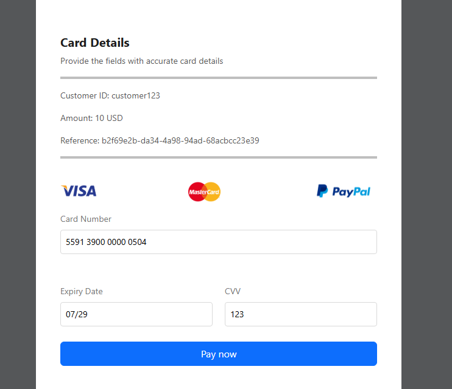
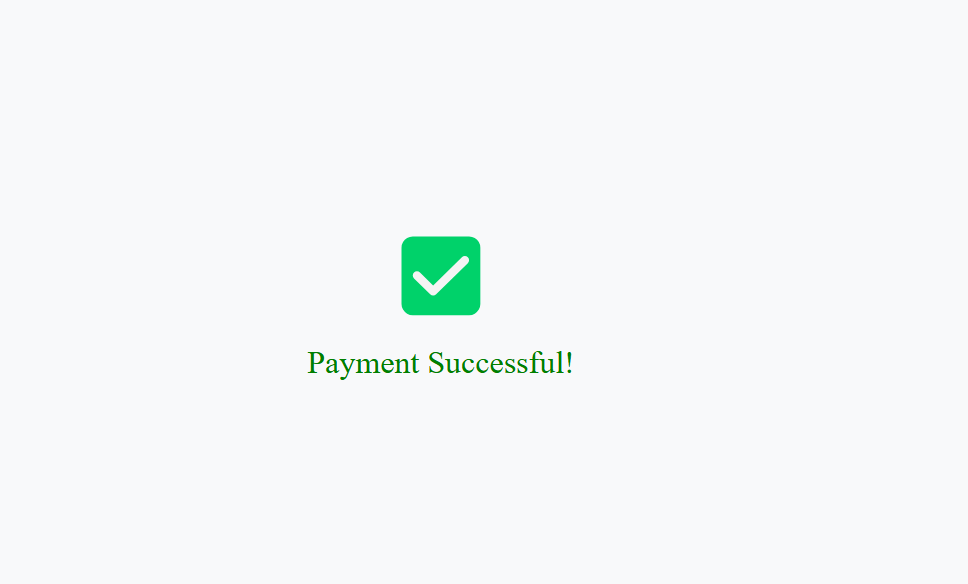
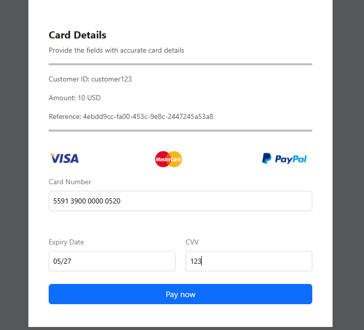
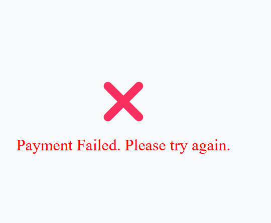

### Test Cards for 3D Secure (3DSv2) Testing
#### (3DSv2) Test Case 1: Successful Frictionless 3-D Secure Authentication & Successful Authorisation
| Card Type | Card Number          | Status | Error Code |
|-----------|-----------------------|---------|-------------|
| AMEX      | 340000000004001       | Y       | 0 – Ok      |
| DISCOVER  | 6573700000000009      | Y       | 0 – Ok      |
| MASTERCARD| 5591390000000504      | Y       | 0 – Ok      |
| VISA      | 4900490000000501      | Y       | 0 – Ok      |

 **Success Cards Test case 1:**

#### (3DSv2) Test Case 2: Failed Frictionless 3-D Secure Authentication & Failed Authorisation
| Card Type | Card Number          | Status | Error Code |
|-----------|-----------------------|---------|-------------|
| AMEX      | 340000000004019       | N       | Not performed |
| DISCOVER  | 6599999900000313      | N       | Not performed |
| MASTERCARD| 5591390000000520      | N       | Not performed |
| VISA      | 4900490000000519      | N       | Not performed |

 **Failed Cards Test case 1:**

### Here is a video where a user tries to make payment using the successful 

<iframe width="560" height="315" src="https://www.youtube.com/embed/rObbWc47aPM" title="Segura Gateway Integration Video" frameborder="0" allowfullscreen></iframe>

### Important Notes on Test Data
- **Expiry Date:** Remember that you need to set the expiry date to any valid date in the future, otherwise an invalid field error will be returned.
- **Security Code:** To pass the security code checks, please use the following values:
  - **"123"** for **DISCOVER**, **MASTERCARD**, and **VISA** cards.
  - **"1234"** for **AMEX** cards.
