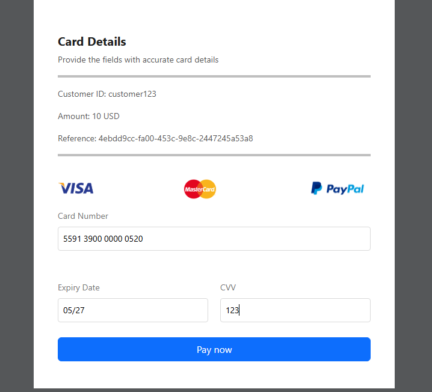

## Segura Gateway Integration Guide

### Introduction
Segura Gateway is a secure and efficient payment gateway that allows businesses to integrate seamless payment solutions into their platforms. This documentation provides an example implementation of the Segura Gateway and highlights key features of the code.

### Example HTML + JavaScript Integration
```html
<html xmlns="http://www.w3.org/1999/xhtml" xml:lang="en">
  <head>
    <meta name="viewport" content="initial-scale=1,width=device-width"/>
    <meta http-equiv="Content-Type" content="text/html; charset=utf-8"/>
    <script src="http://pario.ng/segura/segura-gateway.js"></script>
    <script>
      document.addEventListener("DOMContentLoaded", function () {
        // Initialize the SeguraGateway
        const gateway = new SeguraGateway({
          authKey: "d2FsbGV0X3Rlc3RfY2xpZW50OiRjbGllbnQzNDUwMDA5JA==",
          callbackUrl: "https://yourwebsite.com/payment-callback"
        });

        // Attach event listener to the payment button
        document.getElementById("payButton").addEventListener("click", async function () {
          await gateway.initializePayment({
            amount: 10,
            customerId: "customer123",
            currency: "USD",
            country: "NG", 
            customerName: "Temire Emmanuel", 
            email: "temire@email.com", 
            phoneNumber: "08111223344"
          });
        });
      });
    </script>
  </head>
  <body class="choice st-inputs-style st-blocks-style st-notify-style">
    <button id="payButton">Pay Now</button>
  </body>
</html>
```

### Key Features Demonstrated in the Code
1. **Responsive Design:**
   - The `<meta name="viewport" ...>` tag ensures that the payment page is responsive across different devices.

2. **Character Encoding:**
   - The `<meta http-equiv="Content-Type" ...>` tag ensures proper character encoding (UTF-8).

3. **Script Tags:**
   - The `<script src="http://pario.ng/segura/segura-gateway.js"></script>` loads an external JavaScript library required for the Segura Gateway. 
   - The inline `<script>` block initializes the gateway and attaches a click event listener to the payment button. This block ensures the payment functionality is ready once the page is loaded.

4. **Gateway Initialization:**
   - The `SeguraGateway` object is instantiated with authentication and callback URL details.

5. **Event Handling:**
   - `DOMContentLoaded` ensures the DOM is fully loaded before attaching event listeners.
   - A click event listener is attached to the payment button to initiate the payment process.

6. **Payment Initialization:**
   - `gateway.initializePayment()` is called with customer details such as amount, customerId, currency, country, email, and phoneNumber.

### Security Note
- Always keep your authKey confidential and avoid exposing it on the client side in production.
- Validate and sanitize all inputs on the server side before processing payments.

### Test Cards for 3D Secure (3DSv2) Testing
#### (3DSv2) Test Case 1: Successful Frictionless 3-D Secure Authentication & Successful Authorisation
| Card Type | Card Number          | Status | Error Code |
|-----------|-----------------------|---------|-------------|
| AMEX      | 340000000004001       | Y       | 0 – Ok      |
| DISCOVER  | 6573700000000009      | Y       | 0 – Ok      |
| MASTERCARD| 5591390000000504      | Y       | 0 – Ok      |
| VISA      | 4900490000000501      | Y       | 0 – Ok      |

 **Success Cards Test case 1:**


#### (3DSv2) Test Case 2: Failed Frictionless 3-D Secure Authentication & Failed Authorisation
| Card Type | Card Number          | Status | Error Code |
|-----------|-----------------------|---------|-------------|
| AMEX      | 340000000004019       | N       | Not performed |
| DISCOVER  | 6599999900000313      | N       | Not performed |
| MASTERCARD| 5591390000000520      | N       | Not performed |
| VISA      | 4900490000000519      | N       | Not performed |

 **Failed Cards Test case 1:**



### Here is a video where a user tries to make payment using the successful 

<iframe width="560" height="315" src="https://www.youtube.com/embed/rObbWc47aPM" title="Segura Gateway Integration Video" frameborder="0" allowfullscreen></iframe>


### Important Notes on Test Data
- **Expiry Date:** Remember that you need to set the expiry date to any valid date in the future, otherwise an invalid field error will be returned.
- **Security Code:** To pass the security code checks, please use the following values:
  - **"123"** for **DISCOVER**, **MASTERCARD**, and **VISA** cards.
  - **"1234"** for **AMEX** cards.


### Conclusion
This example showcases the basic integration steps for embedding Segura Gateway into your web application. Developers are encouraged to consult the official Segura Gateway documentation for advanced features and security practices.

