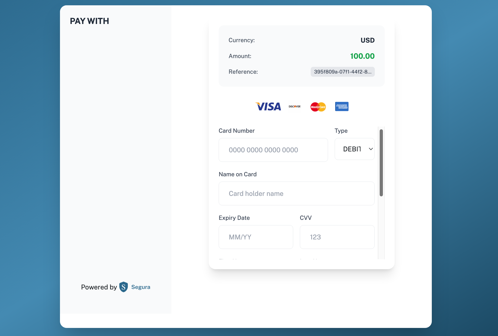
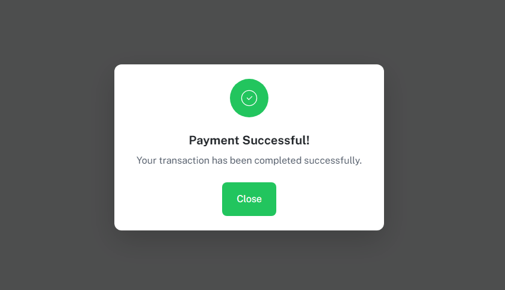

# Segura Payment Gateway API Documentation

### Environment Endpoints
- **Test Environment:** `https://api-dev.segura-pay.com/api/v1/payment-gateway/initialize`
- **Production Environment:** `https://api.segura-pay.com/api/v1/payment-gateway/initialize`

- **Test Hosted Checkouts:** `https://api-dev.segura-pay.com/api/v1/payment-gateway/hosted-payment`
- **Production Hosted Checkouts:** `https://api.segura-pay.com/api/v1/payment-gateway/hosted-payment`


### Initialize Payment Endpoint

```
POST https://api-dev.segura-pay.com/api/v1/payment-gateway/initialize
```

### Request Headers
| Key | Value |
|-----|-------|
| `AuthKey` | `<EncodedAuthKey>` |
| `Content-Type` | `application/json` |

### Request Body
```json
{
  "amount": "string",           // 5 as the minimum value
  "currency": "USD",            // 3-Letter ISO Code format (Supported Currencies)
  "email": "test@example.com",   // Valid Email     
  "country": "NG",               // 2-letter ISO code
  "callbackUrl": "string",       // Optional: Callback URL
  "returnUrl":"string",           // Optional: Return Url         
  "phoneNumber": "string",       // Phone with country code
  "customerName": "string",      
  "clientReference": "string",   // Compulsory: Generate a reference for this transaction
  "narration": "Test Order Description", // Minimum 5 characters
  "address": "100 Main st",       // Minimum 10 Characters
  "paymentMethod": "card",     
  "city": "Seattle",  // Minimum 2 Characters (City Abreviations can be used also)
  "state": "WA",       // Minimum 2 Characters (State Abreviations can be used also)
  "zip_code": "98102",  // Minimum 4 Characters
  "ipAddress": "1.1.1.1"  // Maximum 7 Characters
}
```


### Sample Request
```bash
curl -X POST https://api-dev.segura-pay.com/api/v1/payment-gateway/initialize \
-H "AuthKey: <EncodedAuthKey>" \
-H "Content-Type: application/json" \
-d '{
  "amount": "800",
  "currency": "USD",
  "country": "NG",
   "email": "test@example.com",     
  "callbackUrl": "https://localhost:3000/secure/payments",
  "returnUrl": "https://localhost:3000/secure/payments",
  "phoneNumber": "+9876543210",
  "customerName": "Noah James",
  "clientReference": "ref123456",
  "narration": "Test Order Description",
  "address": "100 Main st",
  "paymentMethod": "card",
  "city": "Seattle",
  "state": "WA",
  "zip_code": "98102",
  "ipAddress": "1.1.1.1"
}'
```

### Response
```json
{
  "requestTime": "2025-08-03T21:02:50.644605309",
  "status": true,
  "code": 200,
  "message": "Payment initiated successfully",
  "data": {
    "reference": "d238dbdb-6fd0-46bc-a325-cd4b551c0087",
    "amount": 500,
    "currency": "USD"
  }
}
```

## Process Payment

After initialization, call the process endpoint to complete the payment using the reference received from either initialization endpoint.

```
POST https://api-dev.segura-pay.com/api/v1/payment-gateway/process
```

**Request Body Example:**
```json
{
  "pan": "5265967392134036",
  "cvv": "123",
  "expiry": "12/2099",
  "expiryMonth": "12",
  "expiryYear": "39",
  "reference": "bba5e540-ea8d-4aa2-ab25-6bef31f6ef2d",   //pass in reference from the initialized request
  "customerdob": "1990-01-01",
  "cardholdername": "John Doe",
  "customerfirstname": "John",
  "customerlastname": "Smith",
  "customerpostcode": "98102",
  "cardScheme": "VISA",
  "cardType": "DEBIT"
}
```

**Response Example:**
```json
{
  "requestTime": "2025-08-03T21:54:44.379512092",
  "status": true,
  "code": 200,
  "message": "Payment processed successfully",
  "data": {
    "success": false,
    "currency": "USD",
    "amount": 500,
    "orderReference": "bba5e540-ea8d-4aa2-ab25-6bef31f6ef2d",
    "status": "SUCCESS"
  }
}
```

### Payment Flow
1. Initialize payment using either the `initialize` or `hosted-payment` endpoint.
2. For `hosted-payment`, redirect user to the `redirectUrl` received in the response:

3. User completes payment on the Segura payment page


### Demo
<iframe width="560" height="315" src="https://www.youtube.com/embed/ygJQscW2M-Y" title="Segura Gateway Integration Video" frameborder="0" allowfullscreen></iframe>

### Webhook Notifications
After transaction completion, Segura sends a webhook notification to your `callbackUrl` if provided:

```json
{
  "reference": "35ca5fa9-2848-47c1-ad78-44127751a24e",
  "status": "successful", // or "failed"
  "amount": 800,
  "currency": "USD",
  "customerReference": "customer101",
  "transactionTime": "2025-02-27T14:43:40.015Z"
}
```

### Webhook Requirements
1. Your `callbackUrl` should be:
   - Publicly accessible
   - Non-authenticated (no authorization headers required)
   - Respond with HTTP 200 OK status


### Hosted Checkouts Endpoint

```
POST https://api-dev.segura-pay.com/api/v1/payment-gateway/hosted-payment
```

### Request Headers
| Key | Value |
|-----|-------|
| `AuthKey` | `<EncodedAuthKey>` |
| `Content-Type` | `application/json` |

### Request Body
```json
{
  "amount": "string",           // 5 as the minimum value
  "currency": "USD",            // 3-Letter ISO Code format (Supported Currencies)
  "email": "test@example.com",   // Valid Email     
  "country": "NG",               // 2-letter ISO code
  "callbackUrl": "string",       // Optional: Callback URL
  "returnUrl":"string",           // Optional: Return Url         
  "phoneNumber": "string",       // Phone with country code
  "customerName": "string",      
  "clientReference": "string",   // Compulsory: Generate a reference for this transaction
  "narration": "Test Order Description", // Minimum 5 characters
  "address": "100 Main st",       // Minimum 10 Characters
  "paymentMethod": "card",     
  "city": "Seattle",  // Minimum 2 Characters (City Abreviations can be used also)
  "state": "WA",       // Minimum 2 Characters (State Abreviations can be used also)
  "zip_code": "98102",  // Minimum 4 Characters
  "ipAddress": "1.1.1.1"  // Minimum 7 Characters
}
```

### Sample Request
```bash
curl -X POST https://api-dev.segura-pay.com/api/v1/payment-gateway/hosted-payment \
-H "AuthKey: <EncodedAuthKey>" \
-H "Content-Type: application/json" \
-d '{
  "amount": "800",
  "currency": "USD",
  "country": "NG",
  "email": "test@example.com",     
  "callbackUrl": "https://localhost:3000/secure/payments",
  "returnUrl": "https://google.com",
  "phoneNumber": "+9876543210",
  "customerName": "Noah James",
  "clientReference": "ref123456",
  "narration": "Test Order Description",
  "address": "100 Main st",
  "paymentMethod": "card",
  "city": "Seattle",
  "state": "WA",
  "zip_code": "98102",
  "ipAddress": "1.1.1.1"
}'
```

### Response
```json
{
  "requestTime": "2025-08-03T21:02:50.644605309",
  "status": true,
  "code": 200,
  "message": "Payment initiated successfully",
  "data": {
    "reference": "d238dbdb-6fd0-46bc-a325-cd4b551c0087",
    "amount": 500,
    "currency": "USD",
      "redirectUrl": "https://segura-web-dev.segura-pay.com/secure/payments?orderreference=fd77d0ee-e0cb-4cda-ad5a-90706b8f7888&sessionId=&paymentMethod=CARD"
  }
}
```


## Check Payment Status

```
GET https://api-dev.segura-pay.com/api/v1/payment-gateway/status/{reference}
```

Replace `{reference}` with the reference from payment initialization.

### Request Headers
| Key | Value |
|-----|-------|
| `AuthKey` | `<EncodedAuthKey>` |

### Sample Status Check
```bash
curl -X GET https://api-dev.segura-pay.com/api/v1/payment-gateway/status/35ca5fa9-2848-47c1-ad78-44127751a24e \
-H "AuthKey: <EncodedAuthKey>"
```

## Important Notes
- Currencies we deal with currently for Payments are `USD`, `GBP` and `EUR`
- The `redirectUrl` is a secure Segura-hosted payment page where customers enter their payment details
- Always store the `reference` to check payment status later
- Monitor the payment status endpoint to confirm successful transactions
- Use test environment for development and testing
- Switch to production environment for live transactions
- Always implement webhook handling for reliable payment status updates
- Webhook endpoints must be publicly accessible
- Return HTTP 200 OK to acknowledge webhook receipt
- The `initialize` endpoint is for programmatic payment flows, while `hosted-payment` (Hosted Checkouts) provides a redirect-based checkout experience

See [Test Cards](./cards.md) for test payment data to use during integration.

