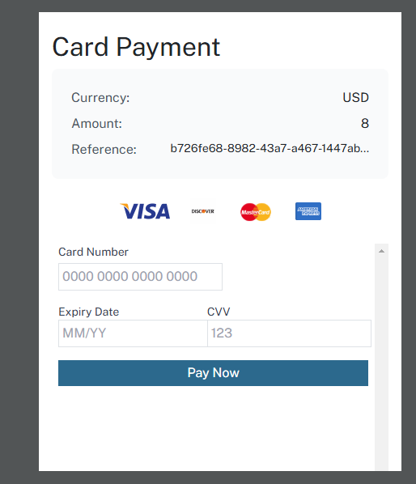

# Segura Payment Gateway API Documentation

## Payment Initialization

### Initialize Payment Endpoint
```
POST https://api-dev.segura-pay.com/api/v1/payment-gateway/initialize
```

### Request Headers
| Key | Value |
|-----|-------|
| `AuthKey` | `<EncodedAuthKey>` |
| `Content-Type` | `application/json` |

### Request Body
```json
{
  "amount": "string",          
  "customerId": "string",      // Unique customer identifier
  "currency": "string",        // Currency code (e.g., USD)
  "country": "string",         // Country code (e.g., NG)
  "callbackUrl": "string",     // Callback URL is optional
  "fullName": "string",        // Customer's full name
  "email": "string",          // Customer's email (optional)
  "phoneNumber": "string"     // Customer's phone with country code
}
```

### Sample Request
```bash
curl -X POST https://api-dev.segura-pay.com/api/v1/payment-gateway/initialize \
-H "AuthKey:  <EncodedAuthKey>" \
-H "Content-Type: application/json" \
-d '{
  "amount": "8",
  "customerId": "customer101",
  "currency": "USD",
  "country": "NG",
  "callbackUrl": "https://localhost:3000/secure/payments",
  "fullName": "Noah James",
  "email": "noah@yopmail.com",
  "phoneNumber": "+9876543210"
}'
```

### Response
```json
{
  "requestTime": "2025-02-27T14:43:40.015052495",
  "status": true,
  "code": 200,
  "message": "Payment initiated successfully",
  "data": {
    "reference": "35ca5fa9-2848-47c1-ad78-44127751a24e",
    "amount": 800,
    "currency": "USD",
    "redirectUrl": "https://segura-web-dev.segura-pay.com/secure/payments?orderreference=35ca5fa9-2848-47c1-ad78-44127751a24e"
  }
}
```

### Payment Flow
1. Initialize payment using the endpoint above
2. Redirect user to the `redirectUrl` received in the response:

3. User completes payment on the Segura payment page

4. User is redirected back to your `callbackUrl` if provided

### Here is a demo where a user tries to make payment via our API

<iframe width="560" height="315" src="https://www.youtube.com/embed/IWQKdWizVac" title="Segura Gateway Integration Video" frameborder="0" allowfullscreen></iframe>


<br>
## Check Payment Status

### Status Check Endpoint
```
GET https://api-dev.segura-pay.com/api/v1/payment-gateway/status/{reference}
```

Replace `{reference}` with the reference received from payment initialization.

### Request Headers
| Key | Value |
|-----|-------|
| `AuthKey` | ` <EncodedAuthKey>` |

### Sample Status Check
```bash
curl -X GET https://api-dev.segura-pay.com/api/v1/payment-gateway/status/35ca5fa9-2848-47c1-ad78-44127751a24e \
-H "AuthKey:  <EncodedAuthKey>"
```

## Important Notes
- The `redirectUrl` is a secure Segura-hosted payment page where customers enter their payment details
- Always store the `reference` to check payment status later
- Monitor the payment status endpoint to confirm successful transactions
- All amounts are processed in the smallest currency unit (e.g., cents for USD)


See [Test Cards](./cards.md) for test payment data to use during integration.